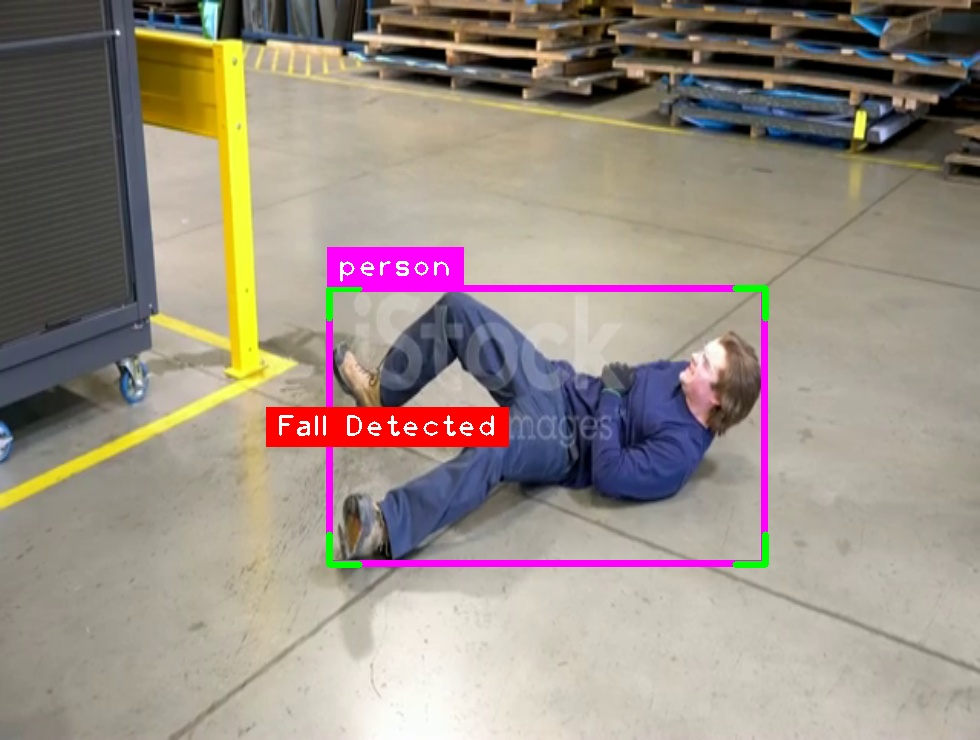
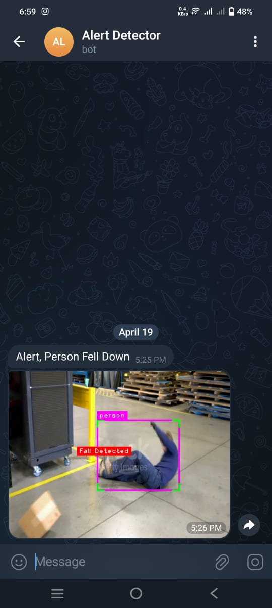

# Fall Detection System

It is a sophisticated fall detection system implemented in Python, utilizing YOLOv8 object detection for precise identification of falls in video streams. Upon detecting a fall, it promptly sends alerts via Telegram, including an image of the incident for added context. This system finds applications in elderly care facilities, public safety, and home monitoring, offering swift assistance and peace of mind to caregivers and family members. Compared to human monitoring, AlertWatch boasts superior speed, consistency, scalability, and accuracy, making it a highly efficient solution for ensuring the safety of individuals in various environments.

## Output

### Output while running the program



After setting up the Telegram Bot.



## Installation

1. Clone the repository:

   ```bash
   git clone 
   ```

2. **Install the required dependencies**:

   ```bash
   pip install -r requirements.txt
   ```

> [!IMPORTANT]
> To send message to your Telegram ID, first create your own bot on Telegram using BotFather. Then, paste your bot token and chat ID into the designated variables in the main.py file. Only after completing this step will you be able to run main.py to receive alert notifications.

## Usage

1. Run the `main.py` script:

   ```bash
   python main.py
   ```

2. Press `t` to exit the application.

## Configuration

- `fall.mp4`: Input video file containing test footage to be analyzed.
- `telegram_bot_token`: Telegram bot token used for sending notifications
[create your own bot and feed the bot token to get message to your phone].
- `chat_id`: Chat ID of the recipient for Telegram notifications.

## Dependencies

- OpenCV
- cvzone
- ultralytics YOLO
- requests
